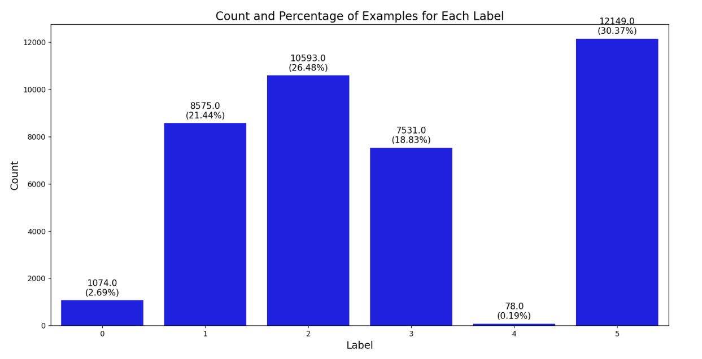
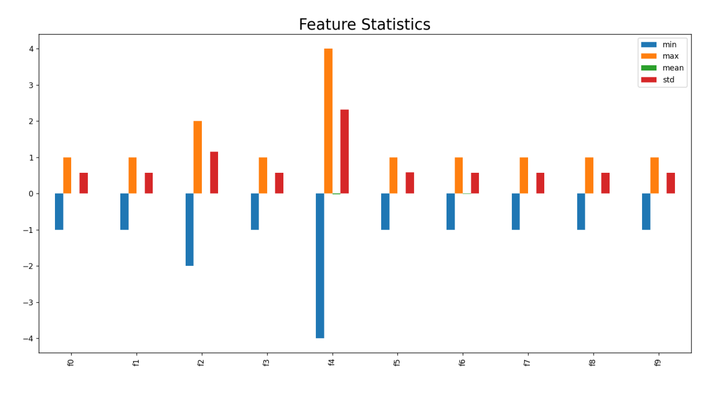

# **ML Classification - Academic Project**

# Project Summary

Tasked with classifying imbalanced 40,000 samples into 6 classes. The challenge was to achieve the highest possible F1 score using only Decision Trees, KNN, and Logistic Regression. Implemented custom ensemble methods, including Random Forest and One-vs-All classifiers, to enhance performance. The final model achieved an F1 score of 95.

## Dataset Overview

### Class Distribution

Our dataset exhibits significant class imbalance, which is an important consideration for our classification task. The following chart illustrates the distribution of examples across different labels:



As we can observe:
- Class 5 has the highest representation with 30.37% of the examples.
- Class 4 is severely underrepresented, comprising only 0.19% of the dataset.
- The remaining classes have varying levels of representation between these extremes.

This imbalance presents challenges for model training and evaluation, requiring strategies such as class weighting or resampling techniques to ensure fair treatment of all classes.

### Feature Distribution

Our features also show varying distributions and scales, as illustrated in the following chart:



Key observations:
- Features exhibit different ranges and distributions.
- Some features (e.g., f4) have significantly larger ranges than others.
- The mean values (green bars) are not centered, indicating potential skewness in the distributions.

This variation in feature scales and distributions necessitates preprocessing steps such as normalization or standardization to ensure all features contribute appropriately to the model's decision-making process.

### Methodology

1. **Ensemble Approach**: We implemented a Stacking Ensemble method, combining multiple base models with a final estimator.

2. **Base Models**:
   - Custom Random Forest (50 trees, 90% sample size, max depth 18, 8 max features)
   - One-vs-All Forest (6 classes, 100 trees)
   - K-Nearest Neighbors (50 neighbors, distance weighting, Manhattan distance)
   - Logistic Regression (liblinear solver, custom class weights, C=10)

3. **Final Estimator**: Another Custom Random Forest (50 trees, 90% sample size, max depth 18, 12 max features)

4. **Data Preprocessing**:
   - StandardScaler for feature normalization
   - PolynomialFeatures (degree=2) for capturing non-linear relationships

5. **Model Training**: 5-fold cross-validation during training

### Results

- F1 Score: 0.94
- Accuracy: 0.94
- Final Project Grade: 98

Detailed performance metrics:

```
              precision    recall  f1-score   support
           0       0.99      0.99      0.99       215
           1       0.96      0.96      0.96      1715
           2       0.94      0.93      0.93      2119
           3       0.91      0.92      0.92      1506
           4       0.75      0.80      0.77        15
           5       0.95      0.95      0.95      2430
    accuracy                           0.94      8000
   macro avg       0.92      0.92      0.92      8000
weighted avg       0.94      0.94      0.94      8000
```

## Key Considerations and Decisions

1. **Ensemble Approach**: Chosen to combine diverse models and capture different aspects of the data.
2. **Custom Implementations**: Custom Random Forest and One-vs-All Forest for more control and to capture unique patterns.
3. **Feature Engineering**: Polynomial features added to capture non-linear relationships.
4. **Model Selection**: Balanced mix of linear (Logistic Regression) and non-linear (Random Forest, KNN) approaches.
5. **Hyperparameter Tuning**: Careful selection of parameters for each model.
6. **Class Imbalance**: Addressed through class weights in Logistic Regression.

## Conclusion

Our implemented solution demonstrates high performance across all classes, with a slight weakness in the underrepresented class 4. The overall F1 score of 0.94 indicates an excellent balance between precision and recall across all classes.

Future work could focus on further optimizing the performance for class 4, perhaps through additional feature engineering or specialized handling of this minority class. include improving runtime performance, which was outside the scope of this project.
